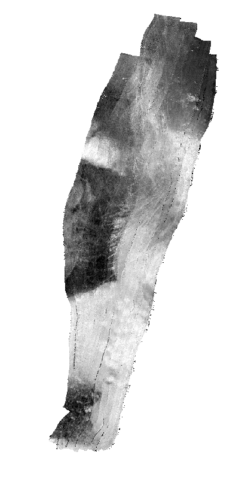
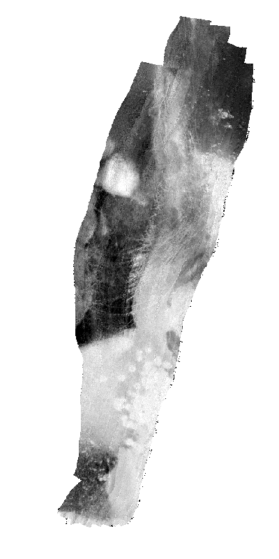

At it's most basic, this package can be used to create a backscatter mosaic from raw multibeam echosounder data. Currently supported data formats are listed on the [repository page](https://github.com/benjaminmisiuk/knightswhosaydb).

First we will use the ```mosaic()``` function to create a backscatter mosaic from Kongsberg KMALL files that are stored in a single directory.


```python
from knightswhosaydb import mosaic

mosaic(
    dir_path='data/KMALL/', #raw data location
    format='kmall', #raw data format
    mosaic_path='scratch/Mosaic.tif', #output mosaic
    crs='EPSG:32622' #coordinate reference system of raw data
)
```

    Found 10 files
    


    Processing files:   0%|          | 0/10 [00:00<?, ?file/s]


    Processing complete. Output mosaic saved as: C:/Users/benja/Documents/ArcGIS/scratch/Mosaic.tif
    

Here is an image of the mosaic visualized using external software.

<br>



These data are from a multifrequency MBES survey. Data were collected at 200, 400, and 600 kHz. We can isolate any one of these frequencies. Additionally, if we have another raster from the area (e.g., bathymetry), we can use that as a template for both resolution and coordinate reference. This is recommended for simplicity and accuracy in many cases. Here we have a 2 m bathymetric grid to use as the template.


```python
mosaic(
    dir_path='../data/KMALL', #raw data location
    format='kmall', #raw data format
    mosaic_path='../scratch/Mosaic_200.tif', #output mosaic
    frequency=200, #frequency to isolate
    template_path='../data/GIS/bathy_2m.tif' #coordinate reference system of raw data
)
```

    Found 10 files
    


    Processing files:   0%|          | 0/10 [00:00<?, ?file/s]


    Processing complete. Output mosaic saved as: ../scratch/Mosaic_200.tif
    


